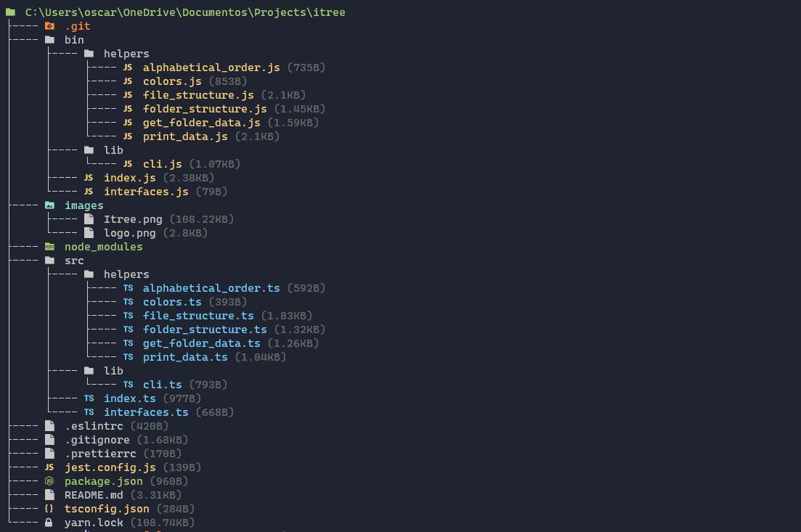

<br>
<br>

<!-- Basic information -->
<div align="center">
  <a href="https://github.com/zitrocode/touch-win">
    
  </a>
  <br>
  <p>
    Graphically displays the directory and file structure of a path with icons
  </p>
  <div align="center">
    <a href="https://github.com/sponsors/zitrocode">
      
    </a> 
    <a href="https://github.com/zitrocode/itree/network">
      
    </a>
    <a href="https://github.com/zitrocode/itree/stargazers">
      
    </a>
    <a href="https://github.com/zitrocode/itree/issues">
      
    </a>
    <a href="https://github.com/zitrocode/itree/blob/master/LICENSE">
      
    </a>
    <a href="https://www.npmjs.com/package/icon-tree">
      
    </a>
  </div>
  <br>
  <div align="center">
    <a href="https://github.com/zitrocode/itree/issues">
     <strong>Report Bug</strong>
    </a>
    ·
    <a href="https://github.com/zitrocode/itree/issues">
     <strong>Request Feature</strong>
    </a>
  </div>
</div>

---

> If you think IconTree is a support for you, please consider making a small donation so that I can continue to allocate time to do more projects like this. <a href="https://github.com/sponsors/zitrocode"><strong>GitHub Sponsor</strong></a>.

<div align="center">
  <a href="https://ko-fi.com/M4M8C5NAP"></a>
</div>

<br>
<div align="center">
  
</div>
<br>

**[IconTree](https://github.com/zitrocode/itree)** is a cli program that helps you display files and folders in the form of a tree with icons, it is inspired by the "tree" command found natively in various operating systems.

🧠 **Don't forget** to give a ⭐ if you like this project!

## 📦 Installation

Install icon-tree your package manager:

```bash
npm install -g icon-tree
```

## 🚀 Usage

```bash
itree --help
```

```bash
Usage: itree [options]

Options:
  -a, --author            Display information from the author of this package                       [boolean]
  -f, --folder            Display the files inside the folder you specified                          [string]
      --folder-contents   Show the content of the folder                                            [boolean]
  -w, --weight            Display the weight of the files                                           [boolean]
  -v, --version           Show version number                                                       [boolean]
  -h, --help              Show help                                                                 [boolean]
```

## 📸 Screenshots

<div align="center">
  
</div>

## 📝 License

This project is **[MIT](./LICENSE)** licensed.
